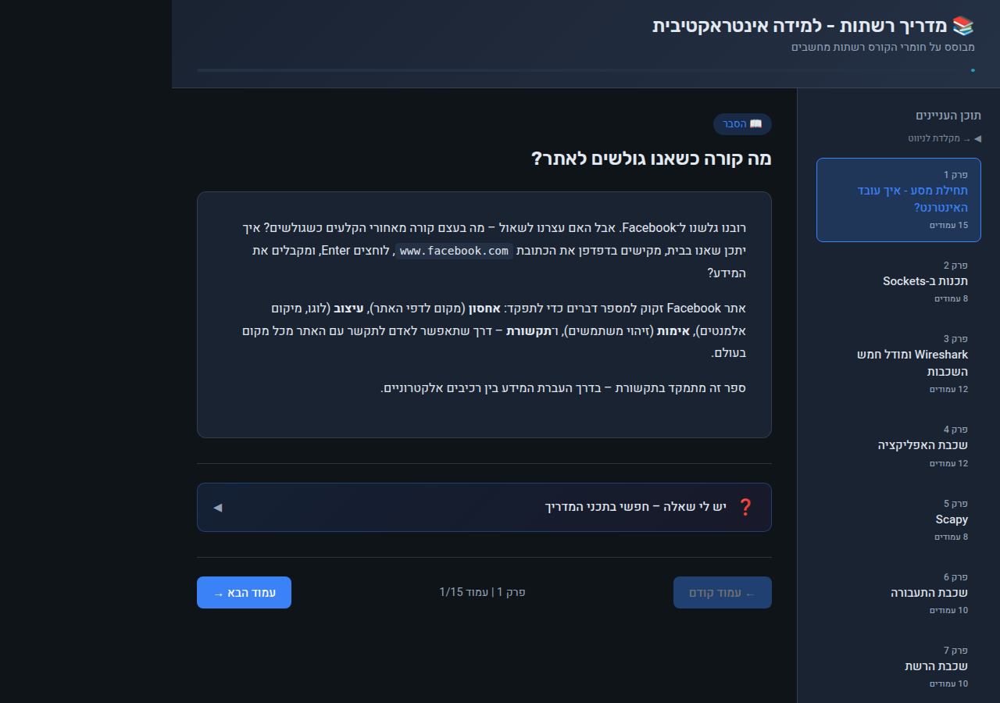
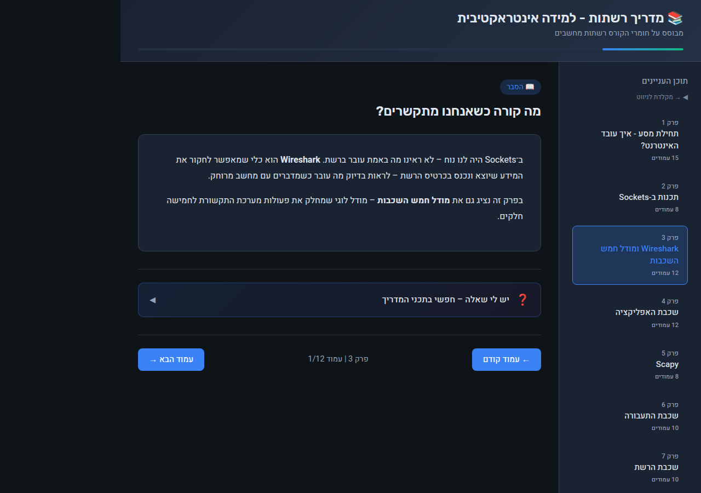
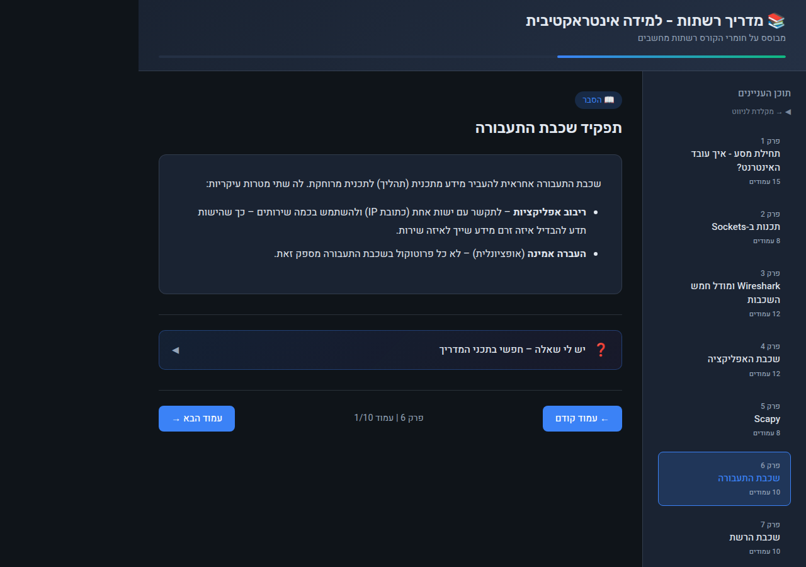
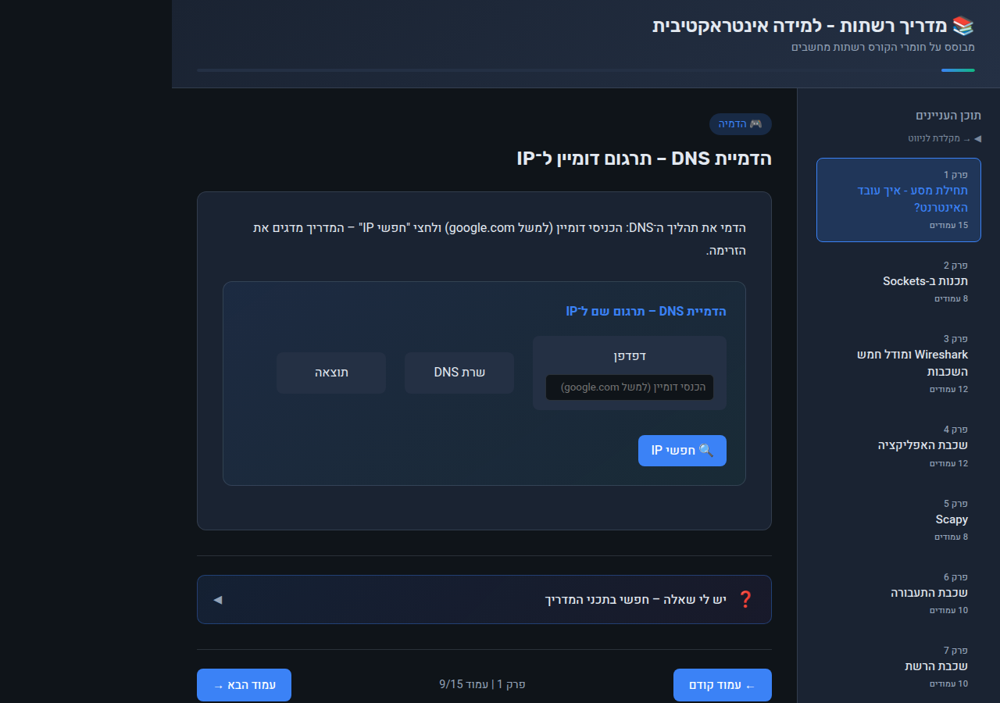

# NetworksGuide — Interactive Computer Networks Learning Guide

> An interactive, self-paced learning guide for computer networks, based on IDF Cyber Unit course materials (רשתות מחשבים, מטה הסייבר הצה"לי v2.2).

Built with **React 19 + Vite 7**, fully in Hebrew (RTL), with live simulations, comprehension exercises, and a chapter-by-chapter navigator.

© 2025 Hila · [MIT License](LICENSE)

---

## Screenshots

### Main View — Chapter Navigator



### Chapter 3 — Wireshark & the Five-Layer Model



### Chapter 6 — Transport Layer



### Interactive Simulation — DNS Lookup



---

## Features

- **14 chapters** covering the full TCP/IP stack from HTTP down to the physical layer
- **Page-by-page navigation** — forward/back buttons and keyboard arrow keys
- **Chapter sidebar** — jump to any chapter directly
- **Progress bar** — tracks how far you've read through all content
- **Interactive simulations** — DNS Lookup, TCP Handshake, Encapsulation/Decapsulation, Packet Flow
- **Comprehension questions** — expandable Q&A at the end of every chapter
- **Demos** — practical code examples (Python sockets, Scapy, Wireshark output, nslookup, ping, traceroute)
- **Think Outside the Box** — bonus deep-dive questions beyond core material
- **"Ask a Question" search** — full-text search across all guide content
- **RTL Hebrew UI** with custom dark theme

---

## Chapters

| # | Title | Topic |
|---|-------|-------|
| 1 | תחילת מסע - איך עובד האינטרנט? | How the Internet works, IP addresses, DNS, HTTP |
| 2 | תכנות ב-Sockets | Python socket programming, client-server model |
| 3 | Wireshark ומודל חמש השכבות | Wireshark, five-layer model overview |
| 4 | שכבת האפליקציה | Application layer: HTTP, DNS, FTP, SMTP |
| 5 | Scapy | Packet crafting and analysis with Scapy |
| 6 | שכבת התעבורה | Transport layer: TCP, UDP, ports, three-way handshake |
| 7 | שכבת הרשת | Network layer: IP routing, ICMP, subnetting |
| 8 | שכבת הקו | Data link layer: Ethernet, MAC addresses, ARP |
| 9 | רכיבי רשת | Network devices: switches, routers, hubs |
| 10 | השכבה הפיזית | Physical layer: cables, signals, encoding |
| 11 | איך הכל מתחבר | End-to-end packet journey — putting it all together |
| 12 | Sockets מתקדם | Advanced sockets: threading, multiplexing |
| 13 | מילון מושגים | Glossary of key networking terms |
| 14 | פקודות וכלים | CLI tools: ping, traceroute, nslookup, netstat, Wireshark |

---

## Interactive Simulations

| Simulation | Description |
|------------|-------------|
| **DNS Lookup** | Type a domain name and watch the resolver query chain step by step |
| **TCP Handshake** | Animated three-way handshake: SYN → SYN-ACK → ACK |
| **Encapsulation** | See data wrapped in headers as it travels down the network stack |
| **Packet Flow** | Follow a packet from your computer through switches and routers to a server |

---

## Tech Stack

- **React 19** + **Vite 7**
- Pure CSS with CSS variables (dark theme, RTL layout)
- No external UI libraries — zero dependencies beyond React
- All content in `src/data/content.js` — easy to extend

---

## How to Run

```bash
git clone https://github.com/hilaln2210/NetworksGuide.git
cd NetworksGuide
npm install
npm run dev
```

Open **http://localhost:5173** in your browser.

### Build for production

```bash
npm run build
# Output in dist/
```

---

## Content Source

Content is based on the publicly available IDF Cyber course textbook:

- [networks.pdf](https://www.lamed-oti.com/school/oe/networks/networks.pdf) — רשתות מחשבים, מטה הסייבר הצה"לי, גרסה 2.2

The guide adds interactive formatting: explanations, code demos, simulations, comprehension questions, and think-outside-the-box challenges.

---

## Project Structure

```
NetworksGuide/
├── src/
│   ├── components/
│   │   ├── TCPHandshakeSim.jsx     # TCP handshake animation
│   │   ├── DnsLookupSim.jsx        # DNS resolver simulation
│   │   ├── EncapsulationSim.jsx    # Layer encapsulation demo
│   │   ├── PacketFlowSim.jsx       # End-to-end packet journey
│   │   ├── ThinkOutsideBox.jsx     # Bonus deep-dive questions
│   │   ├── AskQuestion.jsx         # Full-text content search
│   │   └── KeyTip.jsx              # Highlighted tip boxes
│   ├── data/
│   │   └── content.js              # All 14 chapters of learning content
│   └── App.jsx                     # Main app: navigation, layout, state
├── screenshots/                    # README screenshots
├── package.json
└── README.md
```

---

## License

MIT License — see [LICENSE](LICENSE).

---

## 🇮🇱 תיעוד בעברית

### מה הפרויקט עושה

**NetworksGuide** הוא מדריך לימוד אינטראקטיבי לרשתות מחשבים, מבוסס על חומרי הלימוד של קורס רשתות מחשבים של מטה הסייבר הצה"לי (גרסה 2.2). המדריך כתוב בעברית, בפריסת RTL, ומכיל 14 פרקים המכסים את מחסנית הפרוטוקולים המלאה של TCP/IP — מהשכבה הפיזית ועד שכבת האפליקציה.

**תכונות עיקריות:**
- **14 פרקים** המכסים את כל מחסנית TCP/IP — מ-HTTP ועד השכבה הפיזית
- **ניווט עמוד-אחר-עמוד** — כפתורי קדימה/אחורה ומקשי חצים
- **סרגל פרקים** — קפיצה ישירה לכל פרק
- **סרגל התקדמות** — מעקב אחר קריאת כל התוכן
- **סימולציות אינטראקטיביות** — DNS Lookup, TCP Handshake, Encapsulation, Packet Flow
- **שאלות הבנה** — שאלות ותשובות מתרחבות בסוף כל פרק
- **דמואים מעשיים** — קוד Python, Scapy, Wireshark, nslookup, ping, traceroute
- **חשיבה מחוץ לקופסה** — שאלות העמקה מתקדמות
- **חיפוש תוכן** — חיפוש טקסט מלא בכל חומר הלימוד
- **ממשק עברי מלא** עם ערכת צבעים אפלה ופריסת RTL

### פרקי המדריך

| # | נושא | תוכן |
|---|------|-------|
| 1 | איך עובד האינטרנט? | כתובות IP, DNS, HTTP |
| 2 | תכנות Sockets | Python, מודל לקוח-שרת |
| 3 | Wireshark ומודל חמש השכבות | ניתוח תעבורה, מודל שכבות |
| 4 | שכבת האפליקציה | HTTP, DNS, FTP, SMTP |
| 5 | Scapy | יצירה וניתוח חבילות |
| 6 | שכבת התעבורה | TCP, UDP, פורטים, three-way handshake |
| 7 | שכבת הרשת | IP routing, ICMP, subnetting |
| 8 | שכבת הקו | Ethernet, MAC, ARP |
| 9 | רכיבי רשת | מתגים, נתבים, hubs |
| 10 | השכבה הפיזית | כבלים, אותות, קידוד |
| 11 | איך הכל מתחבר | מסע חבילה מקצה לקצה |
| 12 | Sockets מתקדם | Threading, ריבוב |
| 13 | מילון מושגים | מונחי רשתות מרכזיים |
| 14 | פקודות וכלים | ping, traceroute, nslookup, netstat |

### טכנולוגיות

| שכבה | טכנולוגיה |
|------|-----------|
| Framework | React 19 + Vite 7 |
| עיצוב | CSS טהור עם משתני CSS (ערכת צבעים אפלה, RTL) |
| תלויות | אפס ספריות UI חיצוניות מעבר ל-React |
| תוכן | כל 14 הפרקים ב-`src/data/content.js` — קל להרחבה |

### הוראות התקנה והפעלה

```bash
git clone https://github.com/hilaln2210/NetworksGuide.git
cd NetworksGuide
npm install
npm run dev
```

פתח את [http://localhost:5173](http://localhost:5173) בדפדפן.

**בנייה לסביבת ייצור:**
```bash
npm run build
# הפלט נמצא בתיקיית dist/
```

**מקור התוכן:** המדריך מבוסס על חוברת הקורס של מטה הסייבר הצה"לי — [networks.pdf](https://www.lamed-oti.com/school/oe/networks/networks.pdf). המדריך מוסיף פורמט אינטראקטיבי: הסברים, דמואים, סימולציות ושאלות הבנה.

### מבנה הפרויקט

```
NetworksGuide/
├── src/
│   ├── components/
│   │   ├── TCPHandshakeSim.jsx     # אנימציית TCP Handshake
│   │   ├── DnsLookupSim.jsx        # סימולציית DNS Resolver
│   │   ├── EncapsulationSim.jsx    # הדגמת Encapsulation בין שכבות
│   │   ├── PacketFlowSim.jsx       # מסע חבילה מקצה לקצה
│   │   ├── ThinkOutsideBox.jsx     # שאלות העמקה מתקדמות
│   │   ├── AskQuestion.jsx         # חיפוש טקסט מלא בתוכן
│   │   └── KeyTip.jsx              # תיבות טיפים מודגשות
│   ├── data/
│   │   └── content.js              # כל 14 פרקי חומר הלימוד
│   └── App.jsx                     # אפליקציה ראשית: ניווט, פריסה, מצב
├── screenshots/                    # צילומי מסך לתיעוד
├── package.json
└── README.md
```
